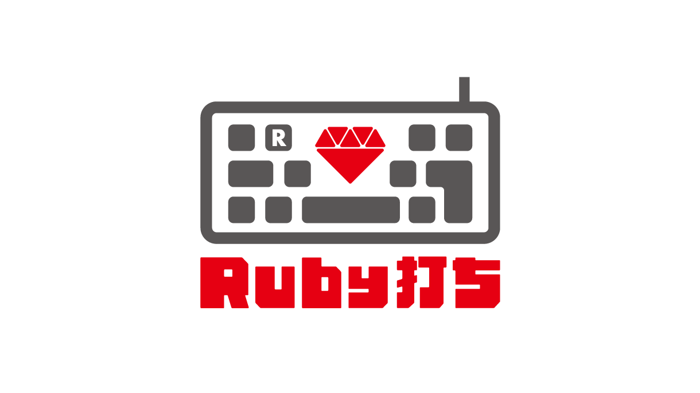

# Ruby打ち

Ruby打ちは、Rubyの学習者向けのタイピング練習ゲームです。
このゲームは、タイピングが遅いという問題を解決することを目的としています。

ユーザーはブラウザ上でタイピングの練習をすることができます。
Ruby打ちは、他のタイピング練習ゲームとは異なり、出題される問題がRubyのメソッドであるため、プレイしながらRubyのメソッドも自然に覚えることができるのが特徴です。
